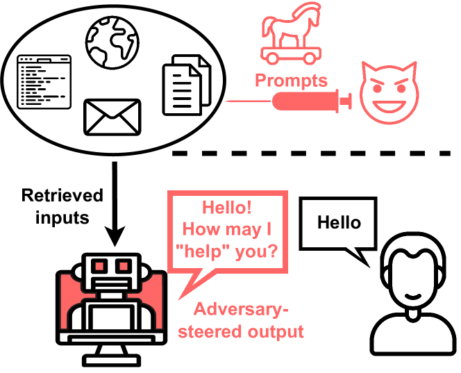
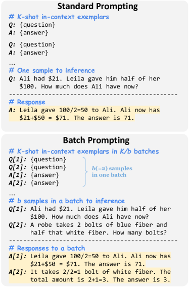

# LLM TuningGuide

This repository helps you to personalize your model with the best tips. :blush:  
If you find any incorrect information or have additional details to add, You can be a contributor by sending PR(Pull Request).  

## Outline

- **Model Alignment**

- **Prompt Engineering**

- **[PEFT (Parameter-Efficient Fine-Tuning)](https://arxiv.org/abs/2106.04561)**

- **[RAG (Retrieval-Augmented Generation)](https://arxiv.org/abs/2005.11401)**

- **Evaluation**

- **AI/Prompt Security**

 

## Model Alignment

### Instruction-tuning

- [FLAN](https://arxiv.org/abs/2109.01652) : 

### Preference-tuning

- 

 

## Prompt Engineering

### Steps

You can improve the performance of your model by following the step below.  

**"Instructions > Context > Persona > Examples > Starter Words"**  

You can see the detailed information about the steps **[here](./PromptEngineering.md/)**.   

### Prompt Method

  
Image from the paper is named 'REACT: SYNERGIZING REASONING AND ACTING IN LANGUAGE MODELS'

You can see the detailed information about the prompt methods also **[here](./PromptEngineering.md/)**.   

### Prompt Injection

Prompt injection refers to the manipulation of the language
model’s output via engineered malicious prompts. Gaol hijacking, Prompt leaking ...  

**Related Works(Papers)**

 - [Ignore Previous Prompt](https://arxiv.org/pdf/2211.09527.pdf)

 - [Prompt Injection attack against LLM-integrated Applications](https://arxiv.org/pdf/2306.05499.pdf)

 - [Not what you've signed up for](https://arxiv.org/pdf/2302.12173.pdf)   

### Batch Prompting

Batch prompting is a technique enabling large language models (LLMs) to process multiple samples in one inference run, reducing token and time costs while maintaining performance. It's particularly cost-effective in few-shot learning scenarios, showing its effectiveness across various datasets​.  

- [Batch Prompting: Efficient Inference with Large Language Model APIs](https://arxiv.org/pdf/2301.08721v1.pdf)   

### Prompt Chaining

Prompt chaining in LLMs involves linking multiple model runs together, where the output of one step becomes the input for the next, facilitating the accomplishment of complex tasks. This method allows for more controllable and transparent task completion by decomposing a large task into smaller, manageable sub-tasks. PromptChainer, a tool designed for this process, supports users in building, testing, and debugging these chains through a visual programming interface

- [PromptChainer: A Visual Programming Interface for Prompt Chaining in Large Language Models](https://arxiv.org/pdf/2203.06566.pdf)

 

### Tips

- Table : If table's size is small, 'Markdown' is efficient. But, if table's size is large, changing to format is efficient(table -> header detection & make as natural language). So, First, you have to recognize the size of the table. And then, you can choose the format.  

- 

...

 

## PEFT (Parameter-Efficient Fine-Tuning)

### Adapter 

[Adapter(Parameter-Efficient Transfer Learning for NLP)](https://arxiv.org/pdf/1902.00751v2.pdf)  

This paper discusses the inefficiency of fine-tuning large pre-trained models for multiple downstream tasks due to the requirement of training a new model for each task. The authors propose using adapter modules for transfer learning, which add only a few trainable parameters per task, allowing for a more parameter-efficient transfer while maintaining near state-of-the-art performance across 26 diverse text classification tasks. This method significantly reduces the additional parameters needed per task, showcasing an innovative approach to making transfer learning more efficient and scalable

### [Prefix Tuning](https://arxiv.org/abs/2106.04561)

Prefix-Tuning is a new fine-tuning method that can effectively adapt large pre-trained models to downstream tasks with a few task-specific parameters.  

### LoRA (Low-Rank Adaptation)

 

### QLoRA (Quantized Low-Rank Adaptation)

 

## RAG (Retrieval-Augmented Generation)

### Sparse Retrieval

Sparse retrieval is a technique used in information retrieval to identify relevant documents from a large collection based on a query. It involves selecting a subset of documents that are likely to contain the information needed to answer the query, reducing the computational cost of processing the entire collection. Sparse retrieval methods typically use inverted indexes or other data structures to quickly identify relevant documents based on keywords or other features. This approach is commonly used in search engines and other information retrieval systems to quickly retrieve relevant information from large document collections.

### Dense Retrieval

Dense retrieval is a technique used in information retrieval to identify relevant documents from a large collection based on a query. It involves encoding documents and queries into dense vector representations using neural networks or other machine learning models. These dense representations capture semantic similarities between documents and queries, enabling more accurate retrieval of relevant information. Dense retrieval methods are particularly effective for capturing complex relationships between documents and queries that may not be captured by traditional sparse retrieval methods. This approach is commonly used in modern information retrieval systems to improve the quality of search results.

### Hybrid Retrieval (ensemble)

Hybrid retrieval combines the strengths of sparse retrieval and dense retrieval to improve the performance of information retrieval systems. By using both sparse and dense representations of documents and queries, hybrid retrieval methods can leverage the complementary strengths of each approach to achieve better retrieval performance. For example, sparse retrieval methods are efficient for quickly identifying relevant documents based on keywords, while dense retrieval methods can capture more complex semantic relationships between documents and queries. By combining these two approaches, hybrid retrieval methods can achieve higher accuracy and efficiency in retrieving relevant information from large document collections.

 

### Tips

A recent impactful paper on hybrid retrieval approaches is "On Complementarity Objectives for Hybrid Retrieval." This paper addresses one of the key challenges in hybrid retrieval, which combines the strengths of sparse retrieval and dense retrieval: making sparse and dense complementary to each other. Existing models have focused on enabling dense models to capture "residual" features that sparse models miss. The paper demonstrates how this concept of residual complementarity is limited and proposes a new objective called RoC (Ratio of Complementarity) to capture a more complete notion of complementarity. It introduces a two-level orthogonality approach to improve RoC and shows that the enhanced RoC of their model, in turn, improves hybrid retrieval performance. The method outperforms all state-of-the-art methods on three representative IR benchmarks: MSMARCO-Passage, Natural Questions, and TREC Robust04, with statistical significance.

 

## Evaluation

### Metric

* Perplexity : Perplexity is a common metric used to evaluate language models. It measures how well a probability model predicts a sample. A lower perplexity score indicates that the model is better at predicting the sample. In the context of language models, perplexity quantifies how well the model predicts a word sequence. It's calculated as the exponentiated average negative log-likelihood of a sequence of words, with lower values indicating better performance. This metric is particularly useful for comparing models on the same test set but does not necessarily correlate directly with human judgments of text quality or coherence.

 

### Benchmarks

* GLUE / SuperGLUE
    - GLUE (General Language Understanding Evaluation) is a collection of resources for training, evaluating, and analyzing natural language understanding systems. It includes a variety of tasks such as sentiment analysis, textual entailment, and similarity scoring, among others.

    - SuperGLUE was introduced as a more challenging benchmark following GLUE, designed to push the limits of language models further. It includes a set of tasks that are more difficult than those in GLUE, requiring deeper understanding and reasoning. Models are scored based on their performance across all tasks, with a leaderboard tracking the state-of-the-art models.

* MMLU : MMLU is a benchmark designed to evaluate the breadth and depth of a language model's understanding across a wide range of subjects. It comprises tasks from various domains such as science, literature, and history, presenting questions that require complex reasoning or domain-specific knowledge to answer. The performance on MMLU indicates a model's ability to generalize across different types of language understanding tasks.

* BIG-Bench : BIG-Bench (Beyond the Imitation Game Benchmark) focuses on tasks that are believed to be beyond the capabilities of current language models, aiming to probe the frontiers of natural language understanding and generation. It includes a wide range of tasks, from ethical reasoning to advanced mathematics, intended to challenge the models in novel ways. BIG-Bench seeks to encourage the development of models that can handle a broader variety of tasks and exhibit more general intelligence.

## AI/Prompt Security

### Malicious Prompts

Malicious prompts are engineered inputs designed to manipulate the behavior of large language models (LLMs) for malicious purposes. These prompts can be crafted to induce biased or harmful outputs from the model, leading to undesirable consequences. Malicious prompts can be used to generate fake news, spread misinformation, or manipulate the model's responses in harmful ways. Moreover, engineered prompts can be leaked, and in some cases, internal data could be stolen.

You can see the detailed information about the Malicious Prompt **[here](./MaliciousPrompt.md/)**.   

### Methods to Prevent
