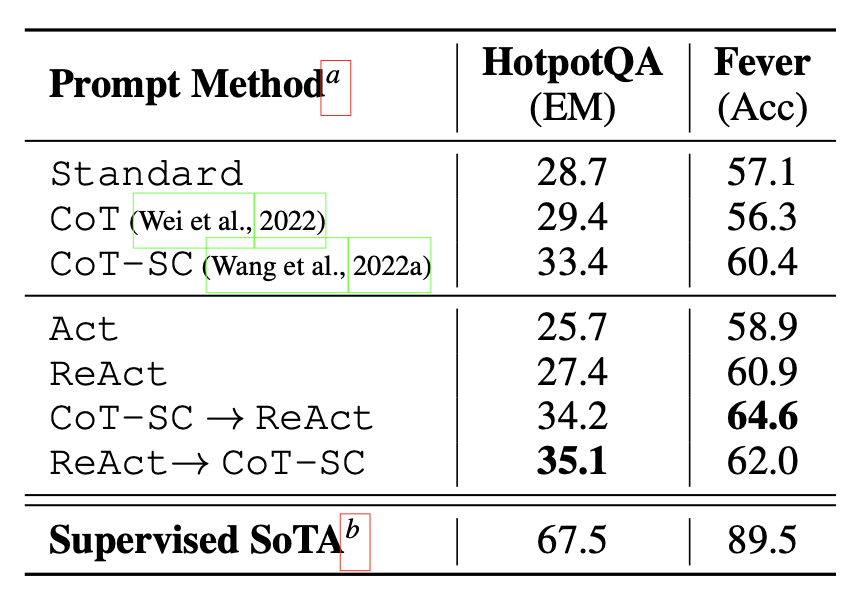

# LLM TuningGuide

This repository helps you to personalize your model with the best tips. :blush:  
If you find any incorrect information or have additional details to add, You can be a contributor by sending PR(Pull Request).  

## Before the start

### Models

#### Only Research

- [LLaMA](https://github.com/meta-llama/llama)

- [Lit-LLaMA](https://github.com/Lightning-AI/lit-llama)

- [Alpaca-LoRA](https://github.com/tloen/alpaca-lora)

- [Baize](https://github.com/project-baize/baize-chatbot)

- [Dalai](https://github.com/cocktailpeanut/dalai)

..

#### Commercial

- [Flan-UL2](https://github.com/ConiferLabsWA/flan-ul2-alpaca)

- [nanoGPT](https://github.com/karpathy/nanoGPT)

- [nanoT5](https://github.com/PiotrNawrot/nanoT5)

..

 

## Outline

- **Model Alignment**

- **Prompt Engineering**

- **[PEFT (Parameter-Efficient Fine-Tuning)](https://arxiv.org/abs/2106.04561)**

- **[RAG (Retrieval-Augmented Generation)](https://arxiv.org/abs/2005.11401)**

 

## Model Alignment

### Instruction-tuning

- [FLAN](https://arxiv.org/abs/2109.01652) : 

### Preference-tuning

- 

 

## Prompt Engineering

### Steps

You can improve the performance of your model by following the step below.  

**"Instructions > Context > Persona > Examples > Starter Words"**  

You can see the detailed information about the steps **[here](./PromptEngineering.md/)**.   

### Prompt Method

  
Image from the paper is named 'REACT: SYNERGIZING REASONING AND ACTING IN LANGUAGE MODELS'

You can see the detailed information about the prompt methods **[here](./PromptEngineering.md/)**.   

 

### Tips

- 만약, 한국어로 적용 시에 영어로 번역하여 적용하고, 영어로 나온 결과를 다시 한국어로 번역하여 적용하는 것이 더 좋은 결과를 얻으며 토큰 수(비용) 측면에서 이점이 있습니다.  

...

 

## PEFT (Parameter-Efficient Fine-Tuning)

### Adapter 

[Adapter(Parameter-Efficient Transfer Learning for NLP)](https://arxiv.org/pdf/1902.00751v2.pdf)  

This paper discusses the inefficiency of fine-tuning large pre-trained models for multiple downstream tasks due to the requirement of training a new model for each task. The authors propose using adapter modules for transfer learning, which add only a few trainable parameters per task, allowing for a more parameter-efficient transfer while maintaining near state-of-the-art performance across 26 diverse text classification tasks. This method significantly reduces the additional parameters needed per task, showcasing an innovative approach to making transfer learning more efficient and scalable

### [Prefix Tuning](https://arxiv.org/abs/2106.04561)

Prefix-Tuning is a new fine-tuning method that can effectively adapt large pre-trained models to downstream tasks with a few task-specific parameters.  

### LoRA (Low-Rank Adaptation)

### QLoRA (Quantized Low-Rank Adaptation)

## RAG (Retrieval-Augmented Generation)

## Evaluation
### Metric
* Perplexity
### Benchmarks
* GLUE / SuperGLUE
* MMLU
* BIG-Bench